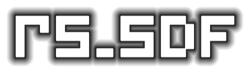

[](https://github.com/Karuma303/rs_sdf/actions) 


# About

A simple library to generate 2-dimensional 
[`Distance Fields`](https://en.wikipedia.org/wiki/Distance_transform) (DF) 
written in pure [`Rust`](https://www.rust-lang.org/) 🦀

The lib can import PNG images, convert them into a 
distance field and export the distances as a PNG again.

## ⚠️ Disclaimer
  
This project is not officially released yet. Its current status is pre-alpha and
every part of the lib is work in progress.  
Please note that this is my personal playground to learn the Rust programming 
language, so don't expect any highly sophisticated code samples here. 
I will try to improve this library over time, however right it is not recommended 
to use it for anything and especially not in production. 😉

## Examples

| Input image| Outer dist. (8bit) | Inner dist. (8bit) |  
| --- | --- | --- |  
|  |  |    

| Combined dist. (8bit) | 2-Channel (8bit) |    
| --- | --- |  
|  |  |  

| Random dots  | Regular dots  |   
| --- | --- |  
|  |  |  


## TODO

- [x] Simple prototype with image input and output  
- [X] SourceProcessor trait  
- [X] Two-channel image output 
- [ ] Project structure (modules, libs, crates, features, examples...)
- [ ] Simple CPU-based Renderer for SDFs (simplification of a FragmentShader)  
- [ ] Update readme and add some documentation  
- [ ] Unit- & Integration-tests
- [ ] More algorithms for distance generation (currently only sweeping)
- [ ] Real signed distance field output  
- [ ] Simple WASM project with some WGPU Shader to demonstrate font rendering with SDFs  
- [ ] Command line interface  
- [ ] OTF/TTF Interface to convert font glyphs to SDFs 
- [ ] Implement some kind of raw byte file output
 
## Links about SDFs and there usage (for example in text rendering) 

1) [`Drawing Text with Signed Distance Fields in Mapbox GL`](https://blog.mapbox.com/drawing-text-with-signed-distance-fields-in-mapbox-gl-b0933af6f817)  
Interesting blog post about MapBox and how they SDF to render the labels on their maps - 
including some source code for a FragmentShader

1) [`Signed Distance Fields`](https://github.com/chriscummings100/signeddistancefields/blob/master/Assets/SignedDistanceFields/SignedDistanceFieldGenerator.cs)  
C# code repository of a SDF generator with different generation algorithms 
(8PSSDT sweep, brute force Eikonal etc.)

1) [`Shader Fun`](https://shaderfun.com/)  
Blogpost series abouts SDFs

1) [`Distance Field Fonts`](https://github.com/libgdx/libgdx/wiki/Distance-field-fonts)  
Nixe explanation about the usage of SDF fonts in libGDX  

1) [`Ronjas Shader Tutorials`](https://www.ronja-tutorials.com/2018/11/10/2d-sdf-basics.html)
2D Signed Distance Field Basics - blog with some posts about SDFs

1) [`The ‘dead reckoning’ signed distance transform`](https://perso.ensta-paris.fr/~manzaner/Download/IAD/Grevera_04.pdf)  
Paper about the dead reckoning algorithm for Distance Field calculation

1) [`8-points Signed Sequential Euclidean Distance Transform`](https://github.com/Lisapple/8SSEDT)  
Explanation of the 8PSSDT algorithm

http://webstaff.itn.liu.se/~stegu/edtaa/

## Fluent syntax

##### Current version
```rust
    let g : DistanceGenerator = DistanceGenerator::new()
        .input(PngInput::new("example/image.png"))
        .output(PngOutput::new("example/image_generated.png",
                               ImageOutputChannels::One,
                               ImageOutputChannelDepth::Eight))
        .export_filter(ExportFilter::Foreground)
        .processor(EightSideSweepProcessor {});

    let result = g.generate();
```

## Input
From ImageBuffer  
From File (File -> ImageBuffer)  
From TTF Font File  
Additional Transformers would be nice too:
Rotate, Flip, B/W, ChannelMatrix (Re-Map Channels), Threshold,
scale (up/down) <- very important ... inc. linear/bi-linear/tri-linear interpolation
Bits per channel Channel (1/8/16/32/64) (Source format) - 
But how do we calculate the output? ->  B/W vs. Greyscale

## Output  
ImageBuffer
File (just a special transformation of an ImageBuffers. Which channels do we use?   
8/16/32 Bit?  
Int or Float?  
Even here we have the options to do multiple transformations (scale, rotate, flip)  


## Configuration  
Used Algorithm (Naive, 8SED, Dead Reckoning, etc.)

In theory it should be possible to apply this to TTF Fonts. For that, we should have an CLI executable
that should be configurable (used glyphs etc)  
SDFs of the glyphs should be packed in some way to a texture atlas. What about hinting?

A good inspirational source is TextMeshPro!

Is there any known file format for SDF Fonts?
